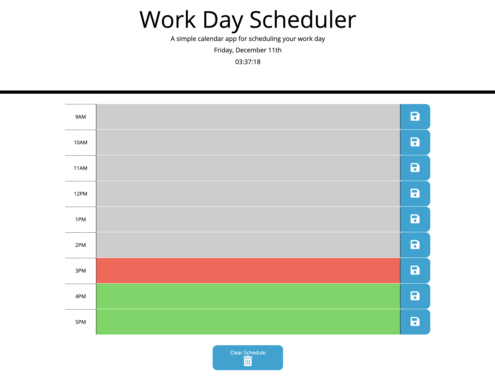

# Work-Day-Planner
## Link to Work Day Planner
https://haywah27.github.io/Work-Day-Planner/

This application is a simple planner that allows a user to save events for each hour of the day. Each event is saved to local storage, therefor the user may close the browser page and still access their plans upon reopening the page. Each hour block is color coded based on the past, present and future hours and will dynamically change as the time proceeds. 

# Summary of changes
* Integrating moment.js library
* Displaying initial moment.js details
* Adding first time block row
* Adding the other time block rows
* Adding color to time blocks based on the current hour
* Creating a footer for padding between time blocks and bottom of page
* Creating event listener to save to local storage
* Creating clear schedule button
* Adding real time clock to page

# Deployed Portfolio Website Image
